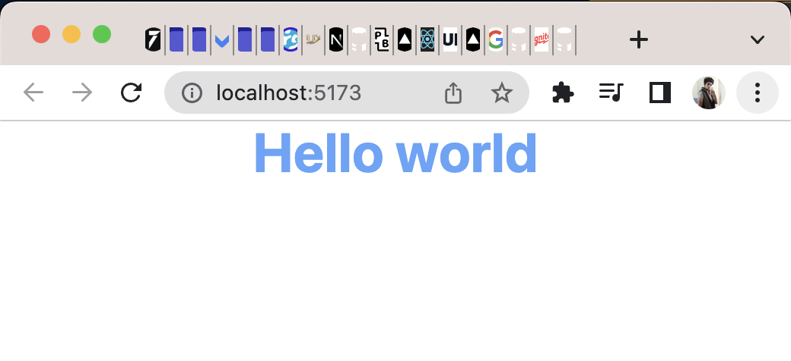

# This is Lesson on of Tailwind

## 01: Setting up tailwind CSS 

### Steps to add Tailwind CSS

1. create a new file name index.html and use shortcut doc and pressing tab to create the html boilerplate
2. add single h1 in the body of the page
3. go to Tailwindcss.com and search for CDN Version of tailwind and add the line privded on the website 
4. you can use privew extension in vs code to see that the style of the hello work change.
5. add class in the h1 and add some utilites in it like font-bold text-center to see the chages

### Steps to add yourown CSS
1. add new file called tailwind.css or what ever name you want to add in the css folder 
2. add the basic three utiles of tailwind @tailwind base; @tailwind components; @tailwind utilities;
3. use command pnpx as i am using pnpm as my package mannager you can use npx too. write "pnpx tailwindcss-cli build css/tailwind.css -o build/tailwind.css"
4. from the above we will get a directory called build where these is tailwind.css you can see what tailwind is adding to this file

### Adding vite this will help us build this css when ever we change our css 
1. Create a package.json file by command `npm init -y` or if your using pnpm like me `pnpm init -y`
2. Add Some Dependies for tailwind by simply this command `npm install -D tailwindcss postcss autoprefixer vite` or `pnpm install -D tailwindcss postcss autoprefixer vite`
- tailwindcss for css 
- postcss is important because it transmit the css when ever e change file
- autoprfixer for any file change 
- vite is for server
3. let change the package.json by adding command `"dev": "vite"`

### Add Tailwind confif file
1. use command `npx tailwindcss init -p` or `pnpx tailwindcss init -p` it will create tailwind.config.js
2. add './index.html' to content array so that tailwind can know that here is being getting used,
3. add link in the index.html change the cdn version to the ` <link  href="/css/tailwind.css" rel="stylesheet">`
4. run command `npm run dev` or `pnpm dev` 
5. the first lession is complate your done install tailwind to your project.

## preivew
