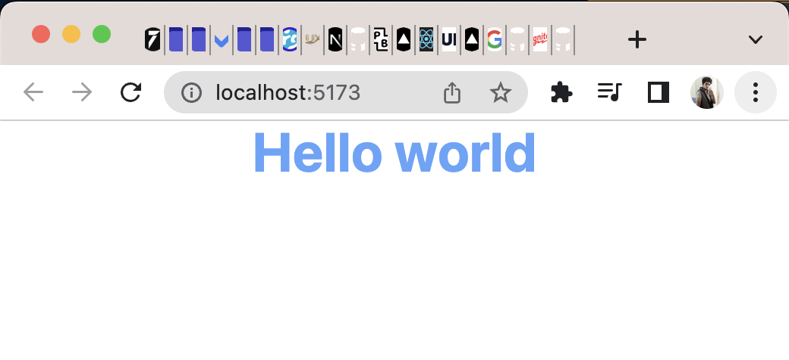

# This is Lesson on of Tailwind

## 11. Adding Prettier to the project

### Steps to add Prettier to vs code

1. go to extension search prettier and install it go to setting and enable format on save option to true.
2. add the prettier to the project by `pnpm i -D prettier` this will add the dependecy to the project.
3. check prettier by using command `pnpx prettier --check index.html` you can use `pnpx prettier --check .` to check all the file it will only check not fix the issue or not format it.
4. to format the file use command `pnpx prettier --write .` to fix all the issue
5. add this code to setting.json of the vscode and now prettier is the default plugin
   `"[typescriptreact]": {
     "editor.defaultFormatter": "esbenp.prettier-vscode"
 },
 "editor.defaultFormatter": "esbenp.prettier-vscode",
 "[javascript]": {
   "editor.defaultFormatter": "esbenp.prettier-vscode"
 }`

### Step to add the prettier tailwind plugin

1. use command `pnpm i -D prettier-plugin-tailwindcss`
2. add the file `.prettierrc` to the root of project
3. add code
   `{ "plugins": ["prettier-plugin-tailwindcss"], "pluginSearchDirs": false }
`
   to make the project run the prettier-plugin work
4. your done now where ever you save your file it will auto sort the tailwind class

## preivew

