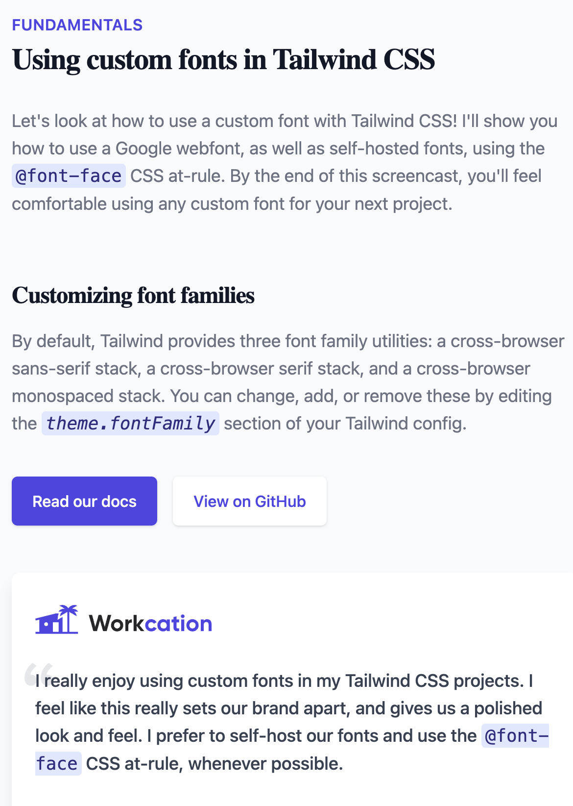

# This is Lesson on of Tailwind

## Custom Fonts with Tailwind CSS

### Step to add font by cd

1. Go to google font and search the font you want to use i am going to use MD Mono and Lora
2. Copy paste the code from google font to the head of the file
3. else Compy this code
   ` <link rel="preconnect" href="https://fonts.googleapis.com" />
    <link rel="preconnect" href="https://fonts.gstatic.com" crossorigin />
    <link
      href="https://fonts.googleapis.com/css2?family=DM+Mono:ital@0;1&family=Lora:wght@700&display=swap"
      rel="stylesheet"
    />`
4. copy and paste the code in tailwind.css or what you have name the css
   `@layer base {
  h1,
  h2 {
    font-family: "Lora, serif";
  }
} `
   you can see that all the h1 and h2 will change there font to Lora

5. we dont want that we want to it more flexible so that we can use it anywhere with tailwind utilites so we extend the theme and font by this code
   `theme: {
    extend: {
    fontFamily: {
      lora: "'Lora', serif",
      // dm: "'DM Mono', monospace",
      mono: ["'DM Mono'", ...defaultTheme.fontFamily.mono],
    },
  },
}`
   now utilies class of font-lora will be avalible use where you want to use it
6. let make the default mono utilies with `DM Mono` extends so we add mono and then it accept array we can extend it using
   `mono: ["'DM Mono'", ...defaultTheme.fontFamily.mono],`
7. now all the mono have default class of `DM Mono` thats it volla we are done

### Step to include your own font file into the tailwind

1. we dont want to use the cdn version for offline or someother reason so we need to add the font files to the public folder in fonts
2. in tailwind css use layer base add following code
   `@layer base {
  @font-face {
    font-family: "Lora";
    src: url("/fonts/Lora-Italic-VariableFont_wght.ttf") format("ttf");
  }
  @font-face {
    font-family: "DM Mono";
    src: url("/fonts/DMMono-Medium.ttf") format("ttf");
  }
  @font-face {
    font-family: "DM Mono";
    font-style: italic;
    src: url("/fonts/DMMono-Italic.ttf") format("ttf");
  }
}`
3. wolla your done the Lora and DM Momo will be working fine again

## preivew

